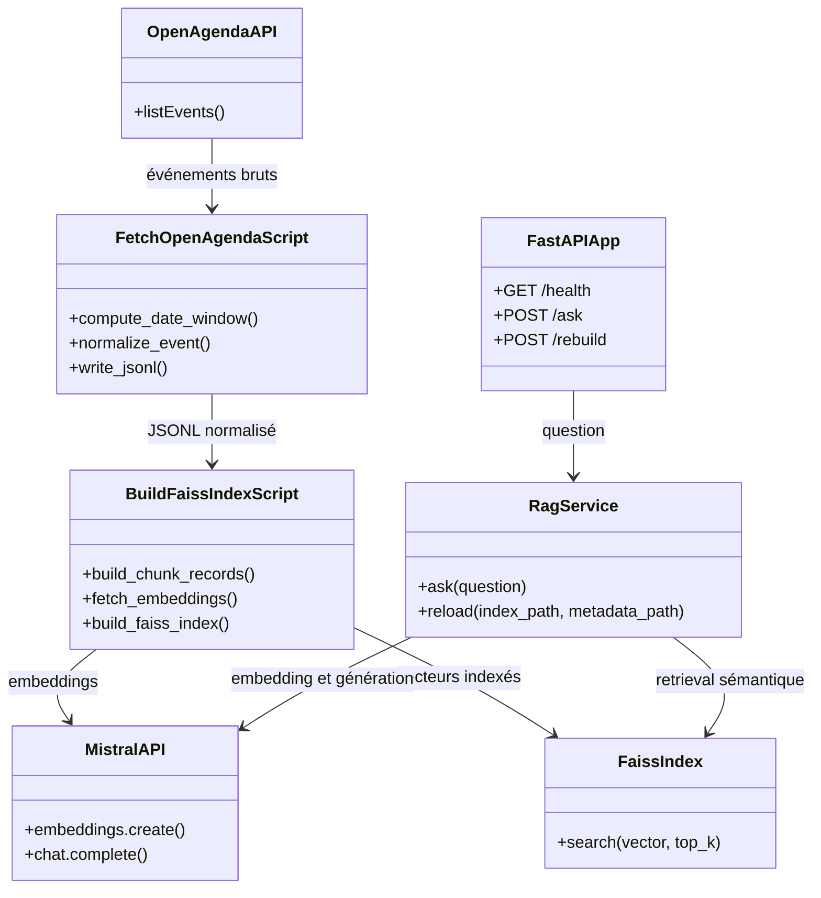

# Rapport technique — Assistant intelligent de recommandation d’événements culturels

## 1. Objectifs du projet

### Contexte et problématique

Puls-Events souhaite vérifier qu’un chatbot peut répondre à des questions en langage naturel sur des événements culturels issus d’OpenAgenda. Une recherche textuelle classique exige de connaître les mots exacts ; le système RAG (Retrieval-Augmented Generation) ajoute une recherche sémantique et fournit au modèle de génération un contexte provenant du corpus d’événements.

### Objectif du POC

Le POC démontre :

- la faisabilité d’un pipeline complet OpenAgenda → embeddings Mistral → FAISS → réponse générée ;
- la valeur métier d’une recommandation formulée naturellement, avec dates, lieux et sources ;
- l’exploitation du système via une API REST documentée et conteneurisable ;
- une première mesure de qualité sur un jeu de test annoté.

### Périmètre

La zone ciblée est l’Île-de-France. Les événements sont récupérés depuis l’API OpenAgenda et la collecte borne systématiquement sa date de début à « date d’exécution − 365 jours ». Une date de fin peut être ajoutée au lancement. Le corpus peut donc contenir des événements passés récents ; le moteur RAG filtre ensuite les événements terminés au moment de la recherche afin de privilégier les recommandations à venir.

Les données utilisées comprennent notamment le titre, les descriptions, les mots-clés, les occurrences, les dates, le lieu et les agendas sources. La collecte exclut par défaut le type `concert`, mais ce filtre est configurable.

## 2. Architecture du système

### Schéma global



### Technologies utilisées

- Python 3.13, géré avec `uv` ;
- OpenAgenda API pour la collecte ;
- Mistral : `mistral-embed` pour les vecteurs et `mistral-small-latest` pour la génération ;
- FAISS (`faiss-cpu`) pour l’index vectoriel ;
- `langchain-core` pour le templating du prompt ;
- FastAPI, Pydantic et Uvicorn pour l’API ;
- pytest et pytest-cov pour les tests ; RAGAS pour l’évaluation ;
- Docker et Docker Compose pour la démonstration locale.

LangChain n’orchestre pas l’ensemble du retrieval : celui-ci est volontairement géré directement par le code applicatif pour garder le contrôle sur FAISS et sur le filtrage temporel.

## 3. Préparation et vectorisation des données

### Source et filtres

Le script `scripts/fetch_openagenda_events.py` interroge l’API OpenAgenda, en mode transverse ou agenda par agenda. Les paramètres principaux sont la région (`Île-de-France` par défaut), une fenêtre ISO 8601 (`--date-from`, `--date-to`), une recherche textuelle, des types inclus ou exclus, le statut officiel des agendas et une limite d’agendas. La stratégie `auto` essaie d’abord le point d’entrée transverse puis bascule, si nécessaire, vers les agendas.

Le script écrit un fichier JSONL ou JSONL compressé et un manifeste JSON. Le manifeste conserve la date d’exécution, la fenêtre de dates, le mode de collecte, le nombre d’agendas parcourus et le nombre d’événements écrits : cela rend une reconstruction du corpus traçable.

### Nettoyage et normalisation

Les champs textuels multilingues sont aplatis en privilégiant le français, puis les autres valeurs textuelles disponibles. Les mots-clés sont uniformisés sous forme de liste. Les champs inutiles au RAG, tels que l’inscription ou l’accessibilité, ne sont pas conservés dans le record normalisé.

Chaque événement comporte un identifiant stable (`openagenda:<uid>`), les descriptions courte et longue, les types, les dates, le lieu normalisé (nom, adresse, ville, département, région), les agendas sources et un champ `document`. Ce dernier concatène titre, résumé, description, types, dates, lieu, conditions et lien d’accès éventuel : c’est le texte vectorisé.

### Chunking et embeddings

Le constructeur d’index réutilise le champ `chunks` s’il est déjà présent. Sinon, il découpe `document` en segments de 800 caractères avec un chevauchement de 120 caractères. Le découpage se fait de préférence sur un espace afin de ne pas interrompre un mot. Le chevauchement préserve le contexte entre deux segments voisins.

Les chunks sont envoyés par lots de 32 à l’API `mistral-embed`. Les vecteurs sont convertis en `float32` puis normalisés L2. Leur dimension n’est pas codée en dur : elle est celle renvoyée par le modèle Mistral et est déduite à la construction de l’index. Les erreurs temporaires et limites de quota (`429`, `5xx`) font l’objet d’un backoff exponentiel, avec jusqu’à six tentatives par défaut et une pause de 0,25 seconde entre lots.

## 4. Choix du modèle NLP

### Modèles sélectionnés

- `mistral-embed` produit les représentations sémantiques utilisées pour retrouver les événements ;
- `mistral-small-latest` rédige la réponse finale à partir des chunks récupérés.

Ce couple est compatible avec les bibliothèques du projet et sépare clairement les tâches de recherche et de génération. Le modèle de chat léger est adapté à un POC : il limite le coût et la latence tout en fournissant une réponse naturelle en français.

### Prompting

Le prompt système demande explicitement de répondre uniquement à partir du contexte, de signaler un contexte insuffisant, de ne jamais inventer d’événement et de citer les titres, dates et lieux disponibles. La date courante est injectée afin d’interpréter les expressions telles que « ce week-end » ou « la semaine prochaine ». La question et les résultats FAISS formatés constituent le message utilisateur.

### Limites

La génération dépend de la disponibilité, des quotas et du comportement du service Mistral. Même avec le prompt de contrainte, une réponse peut extrapoler ; le score de fidélité mesuré confirme que c’est un point de vigilance. La qualité dépend aussi de la complétude des descriptions OpenAgenda et de la fraîcheur de l’index.

## 5. Construction de la base vectorielle

### FAISS et stratégie d’indexation

L’index par défaut est `IndexFlatIP`. Après normalisation L2, le produit scalaire équivaut à une similarité cosinus. Cette recherche exacte est adaptée au volume actuel, d’environ 65 000 chunks : elle ne nécessite ni entraînement ni réglage et garantit le recall maximal. Une variante `IndexIVFFlat`, avec 256 listes par défaut, est disponible pour préparer une montée en charge.

| Critère | `IndexFlatIP` | `IndexIVFFlat` | HNSW |
|---|---|---|---|
| Recherche | exacte | approchée par clusters | approchée par graphe |
| Entraînement | non | oui | non |
| Paramètres à régler | aucun | `nlist`, `nprobe` | `M`, `efConstruction`, `efSearch` |
| Intérêt ici | simplicité et recall | volumes plus grands | très faible latence à grande échelle |

Le moteur récupère un pool élargi — vingt fois `top_k`, avec un minimum de 100 candidats — avant d’éliminer les événements dont `last_timing` est passé. Cette mesure est nécessaire car environ 89 % des chunks du dataset actuel correspondent à des événements terminés.

### Persistance et métadonnées

Par défaut, les fichiers sont enregistrés dans `data/faiss/` :

- `openagenda.index` : index FAISS sérialisé ;
- `openagenda_metadata.pkl` : liste Python de métadonnées, strictement alignée sur l’ordre des vecteurs.

Pour chaque chunk, les métadonnées conservent `id`, `event_uid`, `title`, `date_summary`, `first_timing`, `last_timing`, `location`, `source_agendas`, le document complet, ainsi que `chunk_id`, `chunk_index`, `chunk_text`, `chunk_start` et `chunk_end`. Elles permettent de reconstruire un contexte lisible et de renvoyer les sources dans la réponse API.

## 6. API et endpoints exposés

Le framework utilisé est FastAPI. L’application est lancée avec `uv run uvicorn rag_oc.api:app --reload` et sa documentation interactive est disponible sur `http://127.0.0.1:8000/docs`.

| Endpoint | Rôle |
|---|---|
| `GET /health` | Vérifie que l’API répond (`{"status": "ok"}`). |
| `POST /ask` | Reçoit une question, interroge FAISS, génère la réponse et retourne réponse, sources et contexte. |
| `POST /rebuild` | Reconstruit l’index et recharge le service en mémoire si celui-ci était initialisé. |

Exemple d’appel à `/ask` :

```bash
curl -X POST http://127.0.0.1:8000/ask \
  -H 'Content-Type: application/json' \
  -d '{"question":"Je cherche un atelier à Paris ce week-end","top_k":5,"max_context_items":4,"temperature":0.2}'
```

Le corps de `/ask` accepte `question`, `top_k` (1 à 20), `max_context_items` (1 à 20), `temperature` (0 à 2), ainsi que les noms des modèles de chat et d’embedding. La réponse contient :

```json
{
  "answer": "Réponse générée à partir des événements retrouvés.",
  "sources": [{"title": "…", "score": 0.0, "rank": 1}],
  "context": "Résultat 1 (score=…)\nTitre : …"
}
```

`/rebuild` accepte les chemins d’entrée et de sortie, le modèle, la taille de lot, les paramètres de chunking, le type d’index et les paramètres de reprise. Les validations Pydantic rejettent notamment les valeurs hors bornes ; un chevauchement supérieur ou égal à la taille de chunk et un type d’index inconnu renvoient une erreur `400`. Une clé Mistral absente, un index introuvable ou une erreur de traitement renvoient une erreur `500` avec un message explicite.

Des scénarios prêts à tester sont fournis dans Swagger pour `/ask` (`atelier_paris_weekend`, `sortie_famille`, `expo_gratuite`) et `/rebuild` (`rebuild_standard`, `rebuild_ivf`). Le script `scripts/api_smoke_test.py` vérifie le contrat HTTP de `/health` et `/ask` en local.

## 7. Évaluation du système

### Jeu de test annoté et méthode

Le fichier `tests/rag_eval_sample.jsonl` contient 10 cas annotés. Chaque ligne associe une `question`, une réponse de référence (`ground_truth`), une réponse et des contextes de référence. Les réponses sont évaluées selon leur équivalence de sens avec la référence ; les contextes servent à vérifier la qualité du retrieval. Ce jeu est volontairement réduit : il constitue une base de régression, non une validation statistique exhaustive.

Deux modes sont disponibles via `scripts/evaluate_rag.py` :

1. **static** : évalue les réponses et contextes pré-annotés, de façon reproductible ;
2. **live** : pose les questions au RAG réel, puis mesure toute la chaîne embedding → FAISS → filtrage temporel → génération.

### Métriques et résultats

RAGAS calcule `context_precision` (pertinence des chunks), `answer_relevancy` (adéquation de la réponse à la question) et `faithfulness` (fidélité de la réponse au contexte). La campagne statique de référence donne :

| Métrique | Score | Analyse |
|---|---:|---|
| `context_precision` | 1,0000 | Les contextes du jeu de référence sont pertinents. |
| `answer_relevancy` | 0,8536 | Les réponses sont globalement adaptées aux questions. |
| `faithfulness` | 0,7000 | Certaines réponses extrapolent encore au-delà des chunks. |

Qualitativement, le jeu couvre par exemple la recherche d’un atelier créatif à Paris le week-end, une sortie familiale, une exposition gratuite et une conférence sur l’IA. Les résultats indiquent que le retrieval est satisfaisant sur cet échantillon ; la priorité est de renforcer l’ancrage de la génération au contexte récupéré.

Les tests automatisés couvrent la normalisation OpenAgenda, le découpage, la construction et la recherche FAISS, l’API et le pipeline d’évaluation. La commande `uv run pytest` exécute 76 tests et mesure une couverture globale observée de 71 % ; les appels réseau réels et les interfaces CLI sont les zones principalement non couvertes.

## 8. Recommandations et perspectives

### Ce qui fonctionne bien

Le POC couvre toute la chaîne de valeur : collecte reproductible, index sérialisé, recherche sémantique, filtrage des événements passés, génération sourcée, API documentée et tests. `IndexFlatIP` est un choix robuste pour le volume actuel et le pool élargi résout l’effet du corpus majoritairement historique.

### Limites du POC

- la dépendance à Mistral influence coût, quotas, disponibilité et latence ;
- l’évaluation RAGAS prend plusieurs minutes et n’est donc pas lancée dans la suite de tests par défaut ;
- le jeu de test de 10 cas est trop petit pour généraliser les scores ;
- l’index contient de nombreux événements terminés et doit être reconstruit régulièrement ;
- `/rebuild` devra être protégé avant une exposition partagée ;
- le corpus est limité à l’Île-de-France et à la qualité des fiches OpenAgenda.

### Améliorations proposées

- historiser les campagnes d’évaluation et enrichir le jeu annoté par catégories, villes et contraintes temporelles ;
- ajouter un reranking après FAISS ;
- exposer des filtres métier explicites (date, zone, catégorie, gratuité) ;
- planifier une collecte et une reconstruction d’index régulières ;
- sécuriser l’API, notamment `/rebuild`, et superviser les erreurs et latences ;
- envisager `IndexIVFFlat` puis HNSW lorsque la volumétrie ou les objectifs de latence le justifieront.

## 9. Organisation du dépôt GitHub

```text
.
├── Dockerfile / docker-compose.yml     # exécution conteneurisée
├── main.py                             # point d’entrée applicatif
├── pyproject.toml / uv.lock             # dépendances reproductibles
├── docs/                                # rapport, présentation et guide Mistral
├── enonce/                              # énoncé et template fournis
├── scripts/                             # collecte, indexation, CLI, évaluation, smoke test
├── src/rag_oc/                          # logique applicative (API, RAG, FAISS)
└── tests/                               # tests et jeu de test annoté
```

Les scripts sont des points d’entrée opérationnels ; la logique réutilisable est placée dans `src/rag_oc/`. Les données produites sont attendues sous `data/openagenda/` et `data/faiss/`, sans être nécessaires à la lecture du code. `README.md` fournit les commandes de reproduction, de collecte, d’indexation, de démarrage API, d’évaluation et de démonstration Docker.

## 10. Annexes

### Extrait du jeu de test annoté

```json
{
  "question": "Je cherche un atelier créatif à Paris ce week-end.",
  "ground_truth": "Un atelier créatif à Paris est disponible ce week-end et il est accessible en métro.",
  "contexts": ["Atelier créatif à Paris ce week-end, accessible en métro."]
}
```

### Extrait du prompt système

> Tu réponds uniquement à partir du contexte fourni. Si le contexte est insuffisant, dis-le clairement. Propose des recommandations concrètes, cite les titres, dates et lieux quand ils sont disponibles. N’invente jamais d’événement absent du contexte.

### Reproduction des contrôles principaux

```bash
uv run pytest
uv run python scripts/api_smoke_test.py
SSL_CERT_FILE=/etc/ssl/certs/ca-certificates.crt \
  uv run python scripts/evaluate_rag.py --input tests/rag_eval_sample.jsonl --mode static
```
