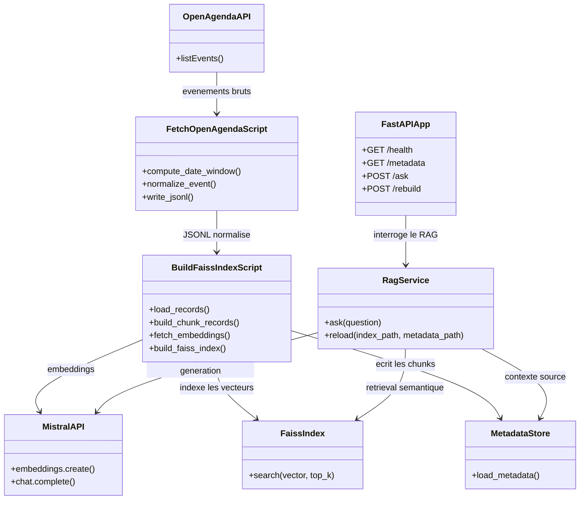

# Rapport technique

## Objectif

Ce projet met en place un systeme RAG local permettant d'interroger des evenements OpenAgenda en langage naturel.
L'objectif metier est de fournir des recommandations d'evenements plus pertinentes qu'une recherche classique par mots-cles, avec une API REST exploitable par des services externes.

## Schema UML

## Role des composants

- `scripts/fetch_openagenda_events.py` collecte les evenements OpenAgenda, borne la fenetre temporelle et normalise chaque evenement dans un format `JSONL` stable pour le RAG.
- `src/rag_oc/build_faiss_index.py` et `scripts/build_faiss_index.py` preparent les chunks, appellent Mistral pour la vectorisation et construisent l'index FAISS ainsi que son fichier de metadonnees.
- `src/rag_oc/rag_service.py` porte la logique metier du RAG : embedding de la question, recherche semantique avec un pool elargi (x20, min 100 candidats), filtrage des evenements passes, reconstruction du contexte puis generation de la reponse. Le pool elargi est necessaire car ~89 % des chunks indexes correspondent a des evenements deja termines.
- `src/rag_oc/api.py` expose cette logique via une API REST FastAPI avec validation et documentation Swagger.
- FAISS gere le retrieval vectoriel. Mistral gere a la fois les embeddings (`mistral-embed`) et la generation (`mistral-small-latest`).

## Choix techniques

### Modele et architecture

- Le modele d'embedding choisi est `mistral-embed` pour transformer les descriptions d'evenements en vecteurs semantiques.
- Le modele de generation choisi est `mistral-small-latest`, suffisant pour un POC avec cout et latence raisonnables.
- L'index FAISS par defaut est `IndexFlatIP` avec normalisation L2, ce qui rend la similarite cosinus simple et rapide a mettre en oeuvre.
- Une variante `IndexIVFFlat` est aussi disponible pour preparer une montee en charge.

### Justification du choix d'index FAISS : IndexFlatIP vs IVF vs HNSW

Le projet utilise `IndexFlatIP` (recherche exacte par produit scalaire apres normalisation L2). Ce choix repose sur les compromis suivants :

| Critere                   | IndexFlatIP (Flat)         | IndexIVFFlat                  | HNSW                          |
|---------------------------|---------------------------|-------------------------------|-------------------------------|
| **Type de recherche**     | Exacte (brute force)      | Approchee (par clusters)      | Approchee (graphe navigable)  |
| **Recall**                | 100 % garanti             | < 100 %, depend de `nprobe`   | Tres eleve mais non garanti   |
| **Complexite requete**    | O(n)                      | O(n/nlist * nprobe)           | O(log n) en pratique          |
| **Entrainement requis**   | Non                       | Oui (clustering k-means)      | Non                           |
| **Parametres a regler**   | Aucun                     | `nlist`, `nprobe`             | `M`, `efConstruction`, `efSearch` |
| **Memoire supplementaire**| Aucune (vecteurs seuls)   | Centroides + inverted lists   | Graphe de voisins (~x1.5-2)   |
| **Ajout dynamique**       | Trivial                   | Possible mais sans re-training| Difficile (reconstruction)    |
| **Rebuild API**           | Instantane                | Necessite re-training          | Lent a construire             |

**Pourquoi IndexFlatIP est adapte ici :**

1. **Volume maitrise** : le dataset contient ~65 000 chunks. A cette echelle, la recherche brute force reste rapide (quelques millisecondes par requete). Le gain d'un index approche ne se justifie pas.
2. **Recall parfait** : avec le filtrage temporel qui elimine ~89 % des resultats, perdre des candidats par approximation degraderait encore la qualite. Le recall de 100 % garantit que tous les evenements futurs pertinents sont bien dans le pool.
3. **Aucun parametre a regler** : IVF necessite de choisir `nlist` et `nprobe`, HNSW demande `M`, `efConstruction` et `efSearch`. Un mauvais reglage degrade silencieusement la qualite. Flat elimine ce risque.
4. **Rebuild simple** : l'endpoint `POST /rebuild` reconstruit l'index a la demande. Flat ne necessite aucune phase d'entrainement, ce qui accelere le rebuild.
5. **Simplicite** : pour un projet etudiant, la complexite supplementaire de HNSW ou IVF n'apporte pas de valeur ajoutee a ce volume.

**Quand migrer vers un autre type d'index :**

- Au-dela de ~500 000 vecteurs, la recherche brute force deviendrait trop lente et IVFFlat serait un bon premier pas.
- Au-dela de ~5 000 000 vecteurs avec un besoin de latence faible, HNSW serait preferable.
- Si le besoin d'ajout dynamique frequent se confirme, IVFFlat reste plus souple que HNSW.

### Adaptation metier

- La base de connaissance est specialisee sur OpenAgenda et cible ici l'Île-de-France.
- Le champ `document` reconstruit un texte exploitable a partir des attributs utiles de l'evenement.
- Les prompts imposent de ne repondre qu'a partir du contexte fourni, de citer dates et lieux et de ne pas inventer d'evenements.
- Les evenements deja termines sont filtres par defaut pour mieux coller a un usage de recommandation.
- Le pool de recherche FAISS est volontairement elargi (x20, min 100) pour compenser le ratio eleve d'evenements passes dans l'index (~89 %). L'ancien multiplicateur (x4) ne laissait presque aucun resultat futur apres filtrage.

### Position exacte de LangChain

LangChain est utilise pour le prompt templating, pas pour l'orchestration complete du retrieval.
Le retrieval FAISS et l'assemblage du contexte sont geres directement dans le code applicatif.

## Resultats et evaluation

### Couverture de tests

Les tests unitaires sont executes avec `pytest-cov`. Couverture actuelle :

| Module                  | Couverture |
|-------------------------|-----------|
| `rag_service.py`        | 81 %      |
| `api.py`                | 74 %      |
| `build_faiss_index.py`  | 62 %      |
| **Total**               | **71 %**  |

Les lignes non couvertes sont principalement le CLI (`parse_args`) et les appels reseau reels (Mistral API).

### Evaluation RAGAS

Le pipeline d'evaluation utilise [RAGAS](https://docs.ragas.io/) v0.3 avec trois metriques :

- **answer_relevancy** : mesure si la reponse generee est pertinente par rapport a la question posee.
- **faithfulness** : mesure si la reponse est fidele au contexte fourni (absence d'hallucination).
- **context_precision** : mesure si les chunks recuperes par FAISS sont pertinents par rapport a la verite terrain.

Deux modes sont disponibles :

1. **Mode static** : evaluation reproductible sur un dataset JSONL pre-annote (`tests/rag_eval_sample.jsonl`).
2. **Mode live** : interrogation du RAG reel pour chaque question du dataset, puis evaluation des reponses obtenues.

Le mode live permet de mesurer la qualite de bout en bout (embedding -> FAISS -> filtrage temporel -> generation).

La campagne static executee sur les 10 cas de `tests/rag_eval_sample.jsonl` donne les resultats suivants :

| Metrique | Score | Lecture |
|---|---:|---|
| `context_precision` | 1,0000 | Les contextes renvoyes par la recherche sont pertinents pour ce jeu de reference. |
| `answer_relevancy` | 0,8536 | Les reponses sont globalement pertinentes par rapport aux questions. |
| `faithfulness` | 0,7000 | Les reponses restent parfois insuffisamment ancrees dans les chunks recuperes ; c'est le principal axe d'amelioration. |

La precision de contexte valide la qualite de la recuperation sur cet echantillon. Les travaux prioritaires portent donc sur le prompt de generation et la contrainte de ne repondre qu'a partir du contexte. Ces scores restent indicatifs en raison de la taille limitee du dataset et devront etre rejoues apres chaque evolution du corpus, de l'index ou du modele.

## Indicateurs lisibles

- Couverture de code : 71 % (81 % sur le moteur RAG principal).
- 76 tests unitaires et d'integration passent.
- Contrat API verifie par smoke test : `GET /health` et `POST /ask` repondent correctement en local.
- Similarite exploitable : chaque source retournee par le moteur RAG expose un `score` numerique, visible dans le contexte et dans la reponse API.
- Jeu de test annote present : `tests/rag_eval_sample.jsonl` (10 cas de test).
- Evaluation RAGAS fonctionnelle en mode static et live ; la campagne static de reference obtient 1,0000 en precision de contexte, 0,8536 en pertinence et 0,7000 en fidelite.

## Resultats observables localement

- `uv run pytest` : `76 tests`, statut `OK`, couverture 71 %.
- `uv run python scripts/api_smoke_test.py` : verification locale du contrat HTTP sur `/health` et `/ask`.
- `SSL_CERT_FILE=/etc/ssl/certs/ca-certificates.crt uv run python scripts/evaluate_rag.py --input tests/rag_eval_sample.jsonl --mode static` : evaluation RAGAS sur donnees pre-calculees. Les appels Mistral sont limites par defaut a une requete toutes les cinq secondes et a une metrique simultanee pour eviter les erreurs de quota (`429`).
- `uv run python scripts/evaluate_rag.py --input tests/rag_eval_sample.jsonl --mode live` : evaluation RAGAS de bout en bout avec le RAG reel.

## Limites actuelles

- L'evaluation RAGAS effectue des appels Mistral et prend plusieurs minutes sur le jeu de test ; elle n'est donc pas lancee dans la suite de tests par defaut.
- Le projet n'utilise pas encore une chaine LangChain complete avec vector store abstrait ; le choix ici privilegie la clarte et le controle direct sur FAISS.
- L'API depend de Mistral pour la vectorisation et la generation, donc la disponibilite externe influence les temps de reponse et les rebuilds.
- La qualite finale depend fortement de la qualite descriptive des evenements OpenAgenda.
- Le dataset contient ~89 % d'evenements passes ; un pool de recherche elargi compense cela, mais un index reconstruit regulierement avec des donnees fraiches ameliorerait la pertinence.

## Ameliorations possibles

- Ajouter une vraie campagne de mesure automatique avec `answer_relevancy`, `faithfulness`, `context_precision` et un tableau de scores historises.
- Ajouter un reranking apres FAISS pour affiner les resultats proches.
- Exposer plus de filtres metier explicites sur la date, le lieu ou la categorie.
- Securiser `/rebuild` avant un deploiement partage.
